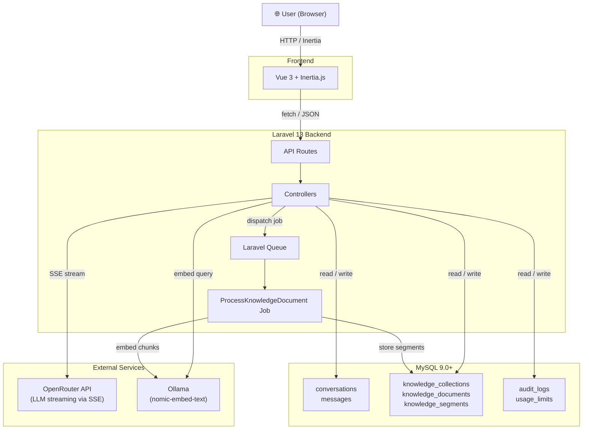

# Architecture

```mermaid
flowchart TD
    User["🌐 User (Browser)"]

    subgraph Frontend["Frontend"]
        Vue["Vue 3 + Inertia.js"]
    end

    subgraph Backend["Laravel 13 Backend"]
        Routes["API Routes"]
        Controllers["Controllers"]
        Queue["Laravel Queue"]
        Job["ProcessKnowledgeDocument Job"]
    end

    subgraph External["External Services"]
        OpenRouter["OpenRouter API\n(LLM streaming via SSE)"]
        Ollama["Ollama\n(nomic-embed-text)"]
    end

    subgraph DB["MySQL 9.0+"]
        Conversations["conversations\nmessages"]
        Knowledge["knowledge_collections\nknowledge_documents\nknowledge_segments"]
        Audit["audit_logs\nusage_limits"]
    end

    User -->|"HTTP / Inertia"| Vue
    Vue -->|"fetch / JSON"| Routes
    Routes --> Controllers
    Controllers -->|"SSE stream"| OpenRouter
    Controllers -->|"embed query"| Ollama
    Controllers -->|"read / write"| Conversations
    Controllers -->|"read / write"| Knowledge
    Controllers -->|"read / write"| Audit
    Controllers -->|"dispatch job"| Queue
    Queue --> Job
    Job -->|"embed chunks"| Ollama
    Job -->|"store segments"| Knowledge
```
